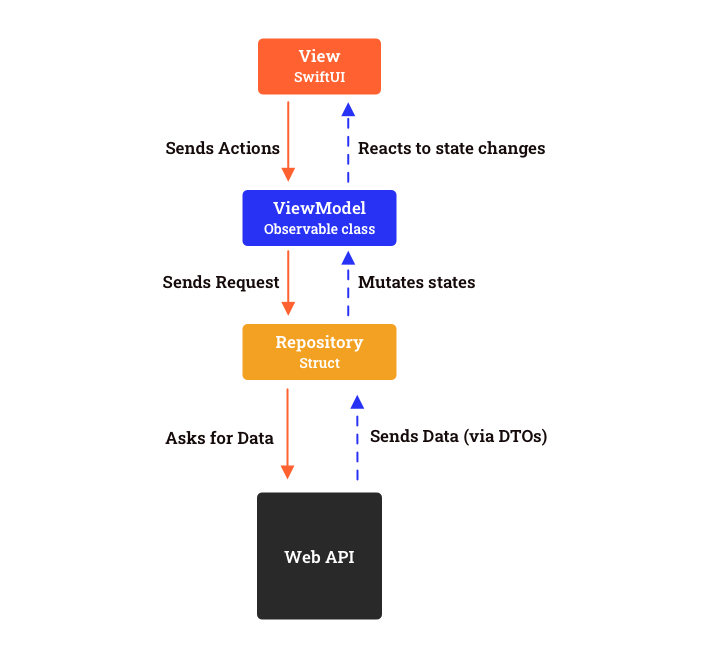
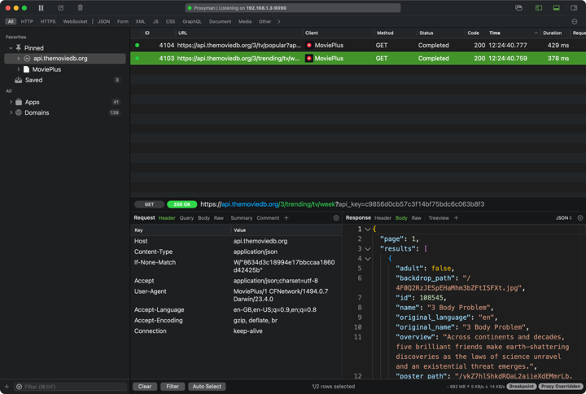
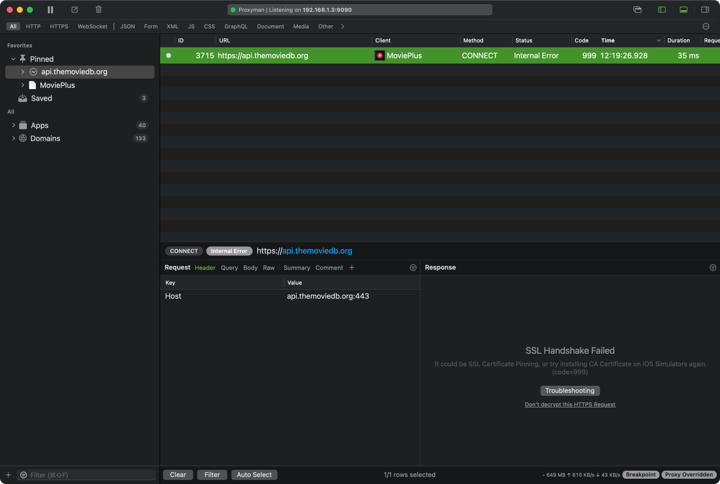

# MoviePlus

## Description:
This iOS app lets you browse movies from the MovieDB API and view their details 
Developer: **[Ibrahima CISS](https://github.com/Bionik6)**

## Usage:
* Open the project in Xcode
* Press `Command + U` to run all the tests suite
* Build and run the project in the simulator or the device
* You can optionally modify the indentation to 4 spaces by editing the `.swiftformat` file located at the root of the project

## Architecture:

This project is structured using the MVVM architectural pattern. The process is as follows:
Views interact with ViewModels, which communicate with Repositories, and these, in turn, connect to Data Sources, specifically Web Services.
Additionally, the key functionalities of the app are divided into separate modules, enabling better separation of concerns, and independent development and testing of individual features.

## Things to mention
- The application is modularized, promoting both modularity and clear separation of responsibilities.
- Dependency Injection is extensively utilized to foster a loosely coupled code structure.
- Instead of protocols, structs are preferred for enhanced flexibility.
- Key modules such as `CoreModels`, `Networking`, and the ViewModels are thoroughly tested, achieving over 90% test coverage for those components.
- SSL-Pinning is implemented to counteract man-in-the-middle attacks, as demonstrated in the accompanying screenshots (*thank you Johan for bringing this during our initial interview*).

|     Before SSL Pinning     |       After SSL Pinning    |
| :--------------------------: | :--------------------------: |
|  |  |

## Things to improve with more time
* Presently, the API key is embedded directly within the code, which is highly inadvisable, especially for production environments. A safer strategy would involve retrieving the key from a remote server and securely storing it in the keychain while enable ssl-pinning to prevent man-in-the-middle attacks and sniffing that key.
* A router could be implemented to decouple navigation between screens allowing better deeplinking capabilities.
* Would get rid of the Xcode warning about `SecTrustGetCertificateAtIndex` being deprecated.
