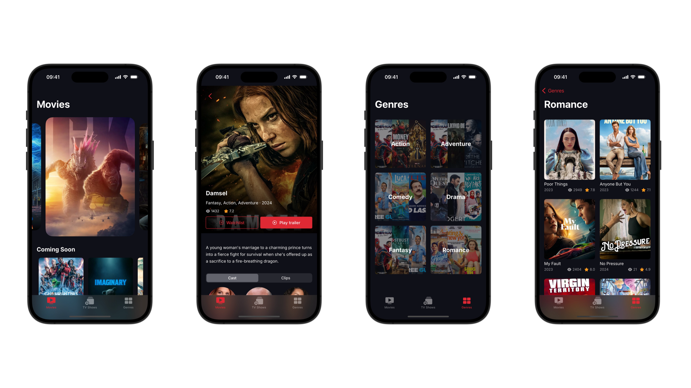

# MoviePlus

## Description:
This iOS app lets you browse movies from the MovieDB API and view their details. 
It was originally intended for [AppDevCon 2024](https://appdevcon.nl/session/build-a-design-system-in-swiftui-with-the-atomic-design-methodology/) workshop about building a Design System in SwiftUI. 
Developer: **[Ibrahima CISS](https://github.com/Bionik6)**

## Usage:
* Open the project in Xcode
* Press `Command + U` to run all the tests suite
* Build and run the project in the simulator or the device
* You can optionally modify the indentation to 4 spaces by editing the `.swiftformat` file located at the root of the project
* Have fun 😊
